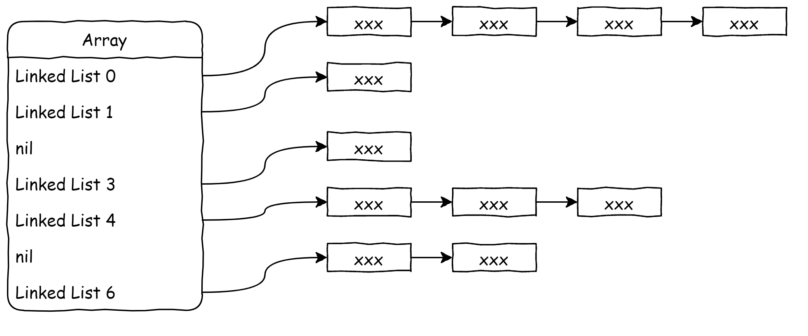



Hash Table（散列表）的实现和应用。



<!-- more -->

## Introduction

Hash Table（散列表）是一种根据键值对存储的数据结构，它使用一个唯一的**Key**来对应一个**Value**，将 Key-Value 键值对存储在数组中的固定位置，从而实现数据元素免查找的寻址。

例如一个**人名-年龄**表：

|  Key  | Value |
| :---: | :---: |
|  Tom  |  38   |
| Jerry |  27   |
| Marry |  89   |
| Lucy  |  77   |

如果要取出某一个人的年龄，只需要根据其名字查询该表即可。然而如果每个元素仅仅是按照进入的顺序存放在数组中，那么查询一个值的最坏情况时间复杂度为$O(n)$，这只是一个普通的键值对数组，并不是一个 Hash Table。

Hash Table 使用 **Hash Function（散列函数）**计算其每一个元素被放置的位置，按照计算值存储元素，从而实现$O(1)$的查询。因此 Hash Table 一个重要的组成部分就是 Hash Function，其本质是*Key-Index*的映射。

理想状态下每个 Key 经过映射得到不同的值作为存储位置，然而现实中当键值对的数量越来越多，多个 Key 经过映射得到了相同的值，这就是**Hash Collision（散列冲突）**。

## Hash Function

Hash Function 通过对 Key 的计算得出其数组下标，有许多不同的 Hash Fuction 可供选择，比如最简单的通过 Ascii 码值取余映射：

将 Introduction 章节中的人名-年龄表存储在一个容量为 7 的数组中，例如存储 Key `Tom`，其每个字母 ASCII 码值分别为 84、111、109，取余计算方式如下：

$$loc=(84+111+109)\pmod7=3$$

因此将其存放在数组中下标为 3 的位置。

显而易见，上述这种简单的 Hash Function 是很容易产生 Hash Collision 的，当两个 Key 经过上述运算得到的值相同时冲突就产生了。

## Hash Collision

前文提到当 Key 经过 Hash Function 计算出来的值相等时会出现 Hash Collision，那么解决冲突就是一个必要的过程。这里提出一种简单常见的处理方式：让数组每个元素维护一个链表，让冲突的值都放在链表当中，如下图：

这个解决方案有几个问题，首先需要遍历链表才能得出某一个数值，其次不能充分利用数组的空间，效率不高。

常见的解决方法有链表法、开放定址法等。

### Linear Probing

## Bitmap

## Dynamic Enlarge
