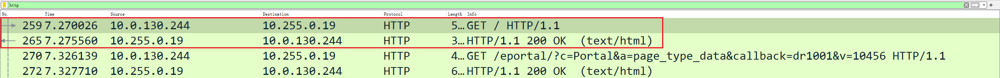



学习计算机网络能够理解网络协议的原理和具体实现，加深对计算机网络体系的认知。



<!-- more -->

## 分层网络

### 协议

协议即约定的一种规则，其确定了计算机网络通信过程中某一部分具体实现的过程和方案等。如HTTP协议规定了一种Web交互方式，计算机可以实现该协议来进行Web通信。

### 协议分层

计算机网络被抽象为多层的结构来处理复杂的信息交换和设备控制，多层抽象的好处是每个层只需要关心其负责的那一部分实现，保证某一层的可用性、安全性、可靠性等。

计算机网络协议分层大致有三种：

- OSI七层模型
- TCP/IP四层模型
- 五层模型

#### OSI七层模型

自顶向下依次为：

- 应用层

	通过网络应用程序及它们的协议来完成特定的网络功能。

- 表示层

	使通信的应用程序能够解释交换数据的含义。

- 会话层

	用于建立通信连接，保持和同步会话，决定通信是否被中断以及通信中断时决定从何处重新发送。

- 运输层

	用于在**应用程序端**之间传送应用层的报文，即将上层协议的报文封装为报文段（segment）传输给目的程序，并按照协议要求实现可靠传输或不可靠传输。Internet提供了两个运输层协议：TCP和UDP，二者提供的传输服务不同。

- 网络层

	用于在**主机**之间传送封装好的数据报（datagram），并实现网络地址、路由等功能。网络层主要协议是IP。

- 数据链路层

	用于建立设备之间的数据链路，在数据链路中传输帧（frame）并利用差错控制等提供可靠传输。

- 物理层
	实现相邻计算机结点间的比特流传输，与实际的物理设备和传输媒介相关。

#### TCP/IP四层协议

- 应用层
- 运输层
- 网络层
- 网络接口层

#### 五层协议

- 应用层
- 运输层
- 网络层
- 数据链路层
- 物理层

#### 三种分层体系的对比

三种体系只是分层不同，相同层次负责的任务基本相同。

## 应用层

### HTTP

当前互联网通用的HTTP版本为HTTP/1.1

HTTP在传输层使用的协议是TCP。

使用Wireshark捕获并过滤http报文：

其中圈中的两个报文分别是客户端对服务端的HTTP请求和服务端对客户端的HTTP响应。右侧说明这是一个GET请求。

#### HTTP方法

HTTP提供了几种方法，应用于不同的场景提供不同的服务：

- GET

	最常用的HTTP方法，通常用于请求服务器发送某个资源并接受返回的实体。

- POST
	用于向服务器发送数据，数据被包含在请求体中。

- PUT
	用于改变服务器某资源的状态，取代或修改其内容。

- DELETE
	请求服务器删除指定的资源，但服务器可在不通知客户端的情况下撤销请求。

- HEAD
	类似于GET方法，但服务器响应时不返回主体，只返回首部信息，可以用于客户端对资源进行首部检查的情况。

- CONNECT
	HTTP/1.1预留的方法，可以将连接改为管道方式的代理服务器。通常用于SSL加密服务器的链接与非加密的HTTP代理服务器的通信。

- OPTIONS
	用于客户端请求服务器告知其支持的各种功能，如询服务器支持哪些方法，查询资源是否可用。

- TRACE
	用于诊断，回显服务器收到的实际请求。

- PATCH
	与PUT请求类似，但PUT一般用于资源的整体更新，并且当资源不存在时PATCH会创建新资源，而PUT不会。

#### GET和POST的对比

|     指标     |   GET   |    POST    |
| :----------: | :-----: | :--------: |
|     速度     | 相对快  |   相对慢   |
| 参数传递方式 | URL传参 |  Body传参  |
|  最大数据量  | 相对少  |   相对多   |
|     用途     |  获取   | 提交、修改 |

- 速度
	- POST请求包含的请求头更多（影响微乎其微）
	- POST请求一般不会进行缓存，而GET请求通常会缓存
	- POST在实际发送数据前会先将请求头发给服务器确认，接着再发送数据
- 数据量
	- GET方法有URL长度限制（HTTP协议未限制，该限制通常由浏览器等决定），能够发送的数据量有限
	- POST方法

#### HTTP状态码

HTTP 响应状态代码指示特定HTTP请求是否已成功完成。

响应分为五类：

- 信息响应(`100`–`199`)
	表示请求已经接收，继续处理。

- 成功响应(`200`–`299`)
	表示请求成功被接收、理解、接受。

- 重定向(`300`–`399`)
	完成请求需要进一步操作。

- 客户端错误(`400`–`499`)

	请求存在语法错误或无法实现。

- 服务器错误 (`500`–`599`)
	服务器未能实现合法的请求。

常见状态码：

- 200 OK

	请求成功。

- 301 Moved Permanently
	被请求的资源已永久移动到新位置。

- 400 Bad Request

	请求语法错误，语义无法被服务器理解，或请求的参数有误。

- 401 Unauthorized

	当前请求需要用户验证。

- 403 Forbidden

	服务器拒绝执行请求的行为。

- 404 Not Found
	请求的资源不存在。

- 429 Too Many Requests
	特定时间内发送了过多的请求。

- 500 Internal Server Error
	服务器遇到了不知道如何处理的情况。

- 502 Bad Gateway

	服务器作为网关需要得到一个处理这个请求的响应但得到了一个错误响应。

- 503 Service Unavailable

	服务器没有准备好处理请求。

- 504 Gateway Timeout
	服务器网关不能及时得到响应。

### HTTPS

### FTP

## 运输层

### TCP

### UDP

## 网络层

### IP

### ICMP

## 数据链路层

## 物理层

## 专有名词

### 概念

|   英文    |   中文    | 注释                                   |
| :-------: | :-------: | -------------------------------------- |
|  packet   |  分组/包  |                                        |
| switching |   交换    | 按照某种方式动态地分配传输线路的资源。 |
|  message  |   报文    | 要发送的整块数据称为一个报文           |
|  header   | 首部/包头 |                                        |

### 网络

|   英文   |  中文  | 注释 |
| :------: | :----: | ---- |
| ARPANET  | 阿帕网 |      |
| Internet | 互联网 |      |

### 技术

|       英文        |   中文   | 注释 |
| :---------------: | :------: | ---- |
| Circuit Switching | 电路交换 |      |
|   Packet Switch   | 分组交换 |      |
|                   |          |      |

### 硬件

| 英文   | 中文   | 注释 |
| ------ | ------ | ---- |
| Router | 路由器 |      |
| Switch | 交换机 |      |
|        |        |      |

