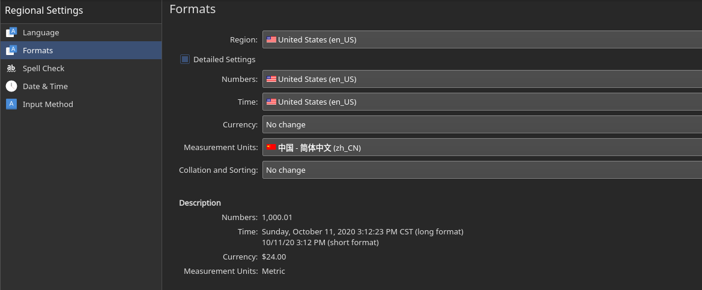



本文参考：[Arch Wiki](https://wiki.archlinux.org/)

装完系统累死我了，淦！



<!-- more -->

## 系统安装

- [镜像](https://www.archlinux.org/download/)

	页面中有国内镜像下载方式

	

- U盘

### 写入镜像

本次使用U盘写入，并且由于我电脑已经存在Manjaro，决定直接用Manjaro写入镜像。

```shell
sudo dd bs=4M if=/path/to/archlinux.iso of=/dev/sdx status=progress && sync
# sdx为U盘位置，自行更改
```

### 安装前的配置

1. 插入U盘，在BIOS中将其作为第一启动项

2. 启动设备，进入Archiso

3. 检查引导方式

	```shell
	ls /sys/firmware/efi/efivars
	# 如果不存在结果则是BIOS引导，反之是UEFI启动
	```

4. 连接网络

	- 无线网络

		```shell
		iwctl
		device list # 显示网络设备，比如我是wlan0
		station wlan0 scan # 扫描无线网络
		station wlan0 get-networks # 获取无线网络
		station wlan0 connect SSID # 连接网络，SSID自行修改
		# 如果存在密码会让你输入，照做即可
		# 退出iwctl
		ping baidu.com # 测试下网络连接是否正常
		```

5. 磁盘分区

	```shell
	lsblk # 查看磁盘
	```

	这里我使用[LVM分区](https://wiki.archlinux.org/index.php/LVM_(%E7%AE%80%E4%BD%93%E4%B8%AD%E6%96%87))分区，使用LVM分区的好处是能够在系统安装后随意改变分区大小、迁移分区等，比较灵活。

   LVM的基本组成部分如下：

    - 物理卷 (PV)
   一个可供存储LVM的块设备. 例如: 一块硬盘, 一个MBR或GPT分区, 一个回环文件, 一个被内核映射的设备 (例如 dm-crypt).它包含一个特殊的LVM头。
    - 卷组 (VG)
      物理卷的一个组，作为存放逻辑卷的容器。
    - 逻辑卷 (LV)
      "虚拟/逻辑卷"存放在一个卷组中并由物理块组成。是一个类似于物理设备的块设备，例如，你可以直接在它上面创建一个文件系统文件系统。
    - 物理块 (PE)
      一个卷组中最小的连续区域(默认为4 MiB)，多个物理块将被分配给一个逻辑卷。你可以把它看成物理卷的一部分，这部分可以被分配给一个逻辑卷。
   
   这里使用**cfdisk**工具分区，将需要的分区类型设置为LVM（Type选项），选择Write写入分区表。

   
 # 以下命令参照自身情况自行修改
```shell
cfdisk /dev/nvme1n1 # 修改nvme1n1（SSD）的分区，如下图
cfdisk /dev/nvme0n1
cfdisk /dev/sda
```


  - 创建物理卷

    ```shell
    pvcreate /dev/nvme1n1p1
    pvcreate /dev/sda4
    pvdisplay # 查看已创建物理卷
    ```


  - 创建卷组

    ```shell
    vgcreate vgp /dev/nvme1n1p1
    vgcreate vgq /dev/sda4
    vgdisplay # 查看已创建卷组
    ```

  - 创建逻辑卷

    ```shell
    lvcreate -L 225G vgp -n lvroot # 分配225G空间给root分区
    lvcreate -l +100%FREE -n lvswap # 分配剩余空间给swap分区
    lvcreate -l +100%FREE -n lvhome # 分配全部空间给home分区
    ```

  - 挂载分区
	**boot所在分区我个人使用的大小是200M，千万不能太小，不然无法使用LVM方式！**

	```shell
	mount /dev/vgp/lvroot /mnt
	mkdir /mnt/boot
	mount /dev/nvme0n1p1 /mnt/boot
	mkdir /mnt/home
	mount /dev/vgq/lvhome /mnt/home
	```

### 开始安装

#### 编辑镜像源

```shell
vim /etc/pacman.d/mirrorlist
# 将国内源放到最前面
# 163
Server = http://mirrors.163.com/archlinux/$repo/os/$arch
# 清华
Server = http://mirrors.tuna.tsinghua.edu.cn/archlinux/$repo/os/$arch
```

#### 安装基本包

```shell
pacstrap /mnt base linux linux-firmware
```

#### 配置fastab

用于自动挂载分区

```shell
genfstab -L /mnt >> /mnt/etc/fstab
```

#### 进入Chroot环境

```shell
arch-chroot /mnt
```

#### 配置mkinitcpio

由于根文件系统基于LVM，因此需要启用mkinitcpio钩子，否则系统可能无法启动。

编辑*/etc/mkinitcpio.conf*文件，在*block*和*filesystems*之间插入*lvm2*。

*/etc/mkinitcpio.conf*

```
HOOKS="base udev ... block lvm2 filesystems ... " # '...'是我省略了的内容，不要写省略号上去！
```

然后重新生成initramfs：

```shell
mkinitcpio -p linux
```

如果报错请自行检查，记得要把boot分区至少设置为200MB，否则会报空间不足的错误。

#### 更改时区

```shell
ln -sf /usr/share/zoneinfo/Asia/Shanghai /etc/localtime
hwclock --systohc
```

#### 网络配置

*/etc/hostname*

```
Secriy-Laptop
```

*/etc/hosts*

```
127.0.0.1	localhost
::1			localhost
127.0.1.1	Secriy-Laptop.localdomain	Secriy-Laptop
```

#### 设置密码

```shell
passwd
```

#### 安装引导

这里使用GRUB

```shell
pacman -S grub efibootmgr # 安装GRUB
grub-install --target=x86_64-efi --efi-directory=/boot --bootloader-id=Arch
grub-mkconfig -o /boot/grub/grub.cfg # 配置
```

#### 安装必需软件

网络管理工具必须安装，否则你没法联网还要回过来下载

```shell
pacman -S iwd networkmanager dhcpcd
systemctl enable --now iwd.service
systemctl enable --now NetworkManger.service # 设置开机自启动并直接启动
```

### 完成安装

```shell
exit # 退出chroot
reboot # 重启
```

## 第一次配置

### 配置GRUB

```shell
grub-mkconfig -o /boot/grub/grub.cfg # 寻找启动项，生成grub配置
```

这里我的机器怎么也找不到Windows的启动项了，经过尝试得出解决方案如下：

```shell
pacman -S os-prober
grub-mkconfig -o /boot/grub/grub.cfg
reboot
```

### 配置网络

配置NetworkManager使用iwd

*/etc/NetworkManager/NetworkManager.conf*

```
[device]
wifi.backend=iwd
```

启动wpa_supplicant

```shell
systemctl enable --now wpa_supplicant.service
systemctl restart NetworkManager.service
```

### 添加普通用户

- 添加用户

	```shell
	useradd -m -G wheel secriy # 创建用户
	passwd secriy # 设置密码
	usermod -d /home/Secriy -m secriy # 修改用户目录名
	```

- 配置sudo权限

	```shell
	pacman -S sudo # 安装sudo
	EDITOR=vim visudo # 使用vim编辑sudoers文件
	```

	将以下文字取消注释

	```
	%wheel ALL=(ALL) NOPASSWD: ALL
	```

### 安装显卡驱动

```shell
# intel
pacman -S xf86-video-intel
# Nvidia
pacman -S nvdia
```

### 安装Xorg

```shell
pacman -S xorg # 安装所有程序包
```

### 安装KDE(Plasma)

个人使用，可以选择其他DE

```shell
pacman -S plasma kde-applications
```

### 安装sddm

```shell
pacman -S sddm
systemctl enable sddm
```

### 安装NetworkManager图形化组件

```shell
pacman -S nm-connection-editor network-manager-applet plasma-nm
```

安装完就可以重启了

## 正式使用的配置

### 配置AUR源

```shell
sudo pacman -S archlinuxcn-keyring
# 安装blackarch
curl -O https://blackarch.org/strap.sh
sudo chmod +x strap.sh
./strap.sh
```

*/etc/pacman.conf*

```
# archlinuxcn源
[archlinuxcn]
SigLevel=TrustedOnly
Server = https://mirrors.ustc.edu.cn/archlinuxcn/$arch

# blackarch源，主要提供渗透测试工具，普通用户无需添加
[blackarch]
SigLevel = Optional TrustAll
Server = https://mirrors.ustc.edu.cn/blackarch/$repo/os/$arch
```

```shell
sudo pacman -Syyu # 更新系统和软件包，无论是否安装blackarch都必须执行
```

### 基础软件安装

```shell
sudo pacman -S git wget zsh apper yay ranger # ranger为命令行下文件管理工具
```

### 配置oh-my-zsh

```shell
chsh -s /usr/bin/zsh # 修改默认shell
sh -C "$(wget https://acgfate-dl.oss-cn-shanghai.aliyuncs.com/install.sh -O -)"
sudo vim ~/.zshrc # 修改配置文件
```

主题：ys

插件：

- git

- zsh-autosuggestions

	```shell
	git clone git://github.com/zsh-users/zsh-autosuggestions $ZSH_CUSTOM/plugins/zsh-autosuggestions
	```

- zsh-syntax-highlighting

	```shell
	git clone https://github.com/zsh-users/zsh-syntax-highlighting.git ${ZSH_CUSTOM:-~/.oh-my-zsh/custom}/plugins/zsh-syntax-highlighting
	```

### 字体安装

```shell
sudo pacman -S ttf-monaco adobe-source-han-sans-cn-fonts
```

### 美化

#### Plasma美化

- Widgets

	- Active Window Control
	- Application Title
	- Global Menu
	- Application Dashboard

- Latte Dock

	```shell
	sudo pacman -S latte-dock
	```

#### Grub美化

**可以使用图形化工具**

```shell
sudo pacman -S grub-customizer
```

1. 下载主题

2. 解压

3. 执行install.sh自动安装

4. 修改分辨率

	*/etc/default/grub*

	```
	GRUB_GFXMODE=1920x1080
	```

5. 修改字体

	```shell
	sudo grub-mkfont -s 16 -o /boot/grub/fonts/Monaco_Linux.pf2 /usr/share/fonts/TTF/Monaco_Linux.ttf
	```

	*/etc/default/grub*
	
	```
	GRUB_FONT="/bot/grub/fonts/Monaco_Linux.pf2"
	```
```
	
	```shell
	grub-mkconfig -o /boot/grub/grub.cfg
```

## 其他软件的安装和配置

### 输入法（fcitx5）

安装

```shell
sudo pacman -S fcitx5 fcitx5-configtool
sudo pacman -S fcitx5-chinese-addons # 输入法引擎
sudo pacman -S fcitx5-qt fcitx5-gtk # 输入法模块
```

配置输入法

*~/.pam_environment*

```
INPUT_METHOD  DEFAULT=fcitx5
GTK_IM_MODULE DEFAULT=fcitx5
QT_IM_MODULE  DEFAULT=fcitx5
XMODIFIERS    DEFAULT=@im=fcitx5
```

*~/.xprofile*

```
export GTK_IM_MODULE=fcitx5
export XMODIFIERS=@im=fcitx5
export QT_IM_MODULE=fcitx5
fcitx5 &
```

注销后重新登录

### 常用软件

```shell
# 方便写注释，因此拆分命令，实际上一行命令就行
sudo pacman -S neofetch
sudo pacman -S google-chrome # Chrome浏览器
sudo pacman -S netease-cloud-music # 网易云音乐
sudo pacman -S xsettingsd # 安装xsettingsd并手动将其设为开机自启动，解决KDE下wine程序不能运行的问题
sudo pacman -S deepin.com.qq.office # 安装Tim
sudo pacman -S flameshot # 截图工具
sudo pacman -S wps-office # WPS Office
sudo pacman -S ttf-wps-fonts # WPS 必需字体
```

```shell
# 开发工具
sudo pacman -S docker
yay -S visual-studio-code-bin
sudo pacman -S nodejs npm go 
```

### 启动SSH服务

```shell
sudo systemctl enable sshd.service
sudo systemctl start sshd.service
```

### 将xsettingsd设置为自启动


### 卸载无用软件包

```shell
sudo pacman -R package-name
```

### 清理软件包

```shell
sudo pacman -Scc # 清理安装包缓存
sudo pacman -R $(pacman -Qtdq) # 清理孤立软件包
```

## 踩坑记录

1. 无法使用中文

   根据上文的输入法配置，软件基本上都是能够正常使用中文的。由于我的系统语言是默认的英文，终端无法显示中文字符，将语言格式化改为UTF8格式即可。
   
   ```shell
   $ locale     
   LANG=en_US.UTF-8
   LC_CTYPE="en_US.UTF-8"
   LC_NUMERIC=en_US.UTF-8
   LC_TIME=en_US.UTF-8
   LC_COLLATE="en_US.UTF-8"
   LC_MONETARY="en_US.UTF-8"
   LC_MESSAGES="en_US.UTF-8"
   LC_PAPER="en_US.UTF-8"
   LC_NAME="en_US.UTF-8"
   LC_ADDRESS="en_US.UTF-8"
   LC_TELEPHONE="en_US.UTF-8"
   LC_MEASUREMENT=zh_CN.UTF-8
   LC_IDENTIFICATION="en_US.UTF-8"
   LC_ALL=
   ```
   
   
   
   经测试，Tim和各类软件均能够正常输入中文。

2. 无线网络冲突

   经常遇到连接无线网需要超级长时间的问题，并且大多数情况都会失败。后来发现是网络工具冲突，wpa_supplicant和NetworkManager不要分开安装，直接安装NetworkManager即可，另外将NetworkManager的backend替换为iwd。具体原因细节我没有深究，文章已经修改为正确的步骤。

3. Tim部分中文显示异常（显示为方块）
   修改*/opt/deepinwine/tools/run.sh*，将**WINE_CMD**改为以下文本：

   ```sh
   WINE_CMD="LC_ALL=zh_CN.UTF-8 deepin-wine
   ```