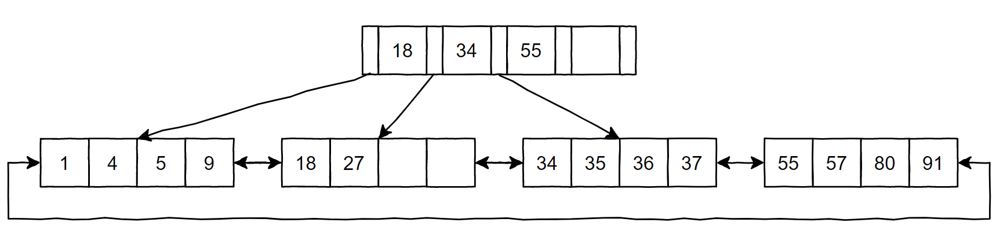



本文是 MySQL InnoDB 存储引擎的相关基础知识总结，主要是对 MySQL 5.7 官方文档 InnoDB 部分进行的翻译和精简，但参考了其他的相关文档（如 MariaDB）以及一些书籍和第三方资料对文章进行补充。本文翻译可能引起歧义的地方都会注明英文原文，以确保不会误导读者。另，本文仅适用于熟悉 MySQL 基本操作以及基本概念的读者。



<!-- more -->

> 测试环境：Server version: 5.7.36-log MySQL Community Server (GPL)

## MySQL 中的存储引擎

MySQL 支持选择甚至自行开发存储引擎，这是一个插件式的体系结构，可以根据场景和需求来从各种拥有不同特性的存储引擎中选择需要的存储引擎。MySQL 中的存储引擎主要有：

- InnoDB
- MyISAM
- MEMORY
- MRG_MYISAM
- CSV
- FEDERATED
- PERFORMANCE_SCHEMA
- BLACKHOLE
- ARCHIVE

> 通过 `SHOW ENGINES;` 命令可以查看。

```
mysql> show engines;
+--------------------+---------+----------------------------------------------------------------+--------------+------+------------+
| Engine             | Support | Comment                                                        | Transactions | XA   | Savepoints |
+--------------------+---------+----------------------------------------------------------------+--------------+------+------------+
| MEMORY             | YES     | Hash based, stored in memory, useful for temporary tables      | NO           | NO   | NO         |
| MRG_MYISAM         | YES     | Collection of identical MyISAM tables                          | NO           | NO   | NO         |
| CSV                | YES     | CSV storage engine                                             | NO           | NO   | NO         |
| FEDERATED          | NO      | Federated MySQL storage engine                                 | NULL         | NULL | NULL       |
| PERFORMANCE_SCHEMA | YES     | Performance Schema                                             | NO           | NO   | NO         |
| MyISAM             | YES     | MyISAM storage engine                                          | NO           | NO   | NO         |
| InnoDB             | DEFAULT | Supports transactions, row-level locking, and foreign keys     | YES          | YES  | YES        |
| BLACKHOLE          | YES     | /dev/null storage engine (anything you write to it disappears) | NO           | NO   | NO         |
| ARCHIVE            | YES     | Archive storage engine                                         | NO           | NO   | NO         |
+--------------------+---------+----------------------------------------------------------------+--------------+------+------------+
9 rows in set (0.00 sec)
```

本节将对 MySQL 中部分存储引擎做一个简略的介绍。

### InnoDB

InnoDB 存储引擎支持**事务**，支持**行锁**和**外键**。

InnoDB 通过 MVCC 来实现高并发性，并实现了四个隔离级别。InnoDB 使用 Next-Key locking 来避免幻读（phantom）。另外它还提供了诸如插入缓冲、二次写、自适应哈希索引、预读等功能来实现**高性能**和**高可用**。

在存储方面，InnoDB 采用**聚集索引**存放所有数据，因此所有表中数据都按照一定的顺序存放。

### MyISAM

MyISAM 存储引擎不支持事务，采用表锁设计，支持全文索引。

## InnoDB 介绍

> `InnoDB` is a general-purpose storage engine that balances high reliability and high performance. In MySQL 5.7, `InnoDB` is the default MySQL storage engine. Unless you have configured a different default storage engine, issuing a [`CREATE TABLE`](https://dev.mysql.com/doc/refman/5.7/en/create-table.html) statement without an `ENGINE` clause creates an `InnoDB` table.
>
> InnoDB 是一个平衡了高可靠性和高性能的通用存储引擎。在 MySQL 5.7 中，InnoDB 是默认的 MySQL 存储引擎。

查看当前使用的数据库版本支持哪些存储引擎：

```mysql
SHOW ENGINES;

SELECT * FROM INFORMATION_SCHEMA.ENGINES;
```

### InnoDB 的主要优势

- 其 DML（Data Manipulation Language，数据操纵语言）操作遵循 ACID 模型，提供带有提交（commit）、回滚（rollback）、崩溃恢复（crash-recovery）能力的事务（transaction）机制。
- 支持行级锁（row-level locking）以及 Oracle 风格的一致读取，提高了多用户并发性和性能。
- InnoDB 基于主键（primary key）在磁盘上排列数据来优化查询。每个 InnDB 表都有一个被称作**聚集索引**（ _clustered index_ ）的主键索引去组织数据，它能够最小化主键查找的 I/O 开销。
- InnoDB 支持外键约束，使用外键时会检查插入、更新和删除，以确保它们不会导致相关表之间的不一致。

### InnoDB 和 MyISAM 的区别

InnoDB：

- 支持 ACID 事务，支持事务的四种隔离级别
- 支持行级锁和外键约束，因此可以支持写并发
- 不存储总行数
- 一个 InnoDB 引擎存储在一个文件空间（共享表空间，表大小不受操作系统控制，一个表可能分布在多个文件里）也有可能为多个（设置为独立表空，表大小受操作系统文件大小限制，一般为 2G），受操作系统文件大小的限制
- 主键索引采用聚集索引，二级索引存储主键的值

MyISAM：

- 不支持事务，但是每次查询都是原子的
- 支持表级锁，即每次操作是对整个表加锁
- 存储表的总行数
- 一个 MyISAM 表有三个文件：索引文件、表结构文件、数据文件
- 采用非聚集索引，索引文件的数据域存储指向数据文件的指针。二级索引与主键索引基本一致，但是二级索引不用保证唯一性

### InnoDB 最佳实践

本节介绍使用 InnoDB 表时的最佳实践，即优化性能等方面的实践。

> 从官方提供的最佳实践能够看出一部分 InnoDB 的优势、它能够解决的问题以及它存在的问题。

- 使用最常查询的一列或多列为每个表指定主键，如果没有明显的主键，则为其指定自动递增值。
- 使用联接来从多个带有相同 ID 值的表中查询数据。为了提高联接的性能，在联接的列上定义外键，并在每个表中对这些列定义相同的数据类型。添加外键可确保引用的列被索引，从而提高性能。外键还会将删除和更新操作传递到所有其他受影响的表中，如果父表中不存在相应的 ID，则会阻止在子表中插入数据。
- 关闭自动提交。每秒提交数百次会降低性能（受存储设备的写入速度限制）。
- 使用 `START TRANSACTION` 和 `COMMIT` 语句将相关 DML 操作集合括起来，将它们分组到事务中。虽然不应该 commit 太频繁，但保留大量的未提交语句（`INSERT`，`UPDATE`，`DELETE`），让其执行数个小时也是不合适的。
- 不要使用 `LOCK TABLES` 语句。InnoDB 不需要牺牲可靠性和性能就可以处理多个会话并同时对同一个表进行读写。要获得对多个行的独占写入权限，请使用 `SELECT ... FOR UPDATE` 语法，这样仅会锁定要更新的行。
- 启用 `innodb_file_per_table` 变量或使用常规表空间，从而将表的数据和索引放入单独的文件中，而不是去使用系统表空间。默认情况下，`innodb_file_per_table` 变量处于启用状态。
- 评估你的数据和访问模式是否受益于 InnoDB 表或页面的压缩功能。你可以在不牺牲读/写功能的情况下压缩 InnoDB 表。
- 使用 `--sql_mode=NO_ENGINE_SUBSTITUTION` 选项运行服务器，以防止使用不希望使用的存储引擎创建表。

## InnoDB ACID 模型

> The [ACID](https://dev.mysql.com/doc/refman/5.7/en/glossary.html#glos_acid) model is a set of database design principles that emphasize aspects of reliability that are important for business data and mission-critical applications. MySQL includes components such as the `InnoDB` storage engine that adhere closely to the ACID model so that data is not corrupted and results are not distorted by exceptional conditions such as software crashes and hardware malfunctions. When you rely on ACID-compliant features, you do not need to reinvent the wheel of consistency checking and crash recovery mechanisms. In cases where you have additional software safeguards, ultra-reliable hardware, or an application that can tolerate a small amount of data loss or inconsistency, you can adjust MySQL settings to trade some of the ACID reliability for greater performance or throughput.
>
> ACID 模型是一组数据库设计原则，强调对业务数据和任务关键型应用程序非常重要的**可靠性**方面。MySQL 包含 InnoDB 存储引擎等组件，这些组件与 ACID 模型紧密相连，因此数据不会被破坏，结果不会因为软件的崩溃和硬件的故障等异常情况而不正确。当你依赖与 ACID 兼容的功能时，无需重新发明一致性检查和崩溃恢复机制。如果你已经有了额外的软件保护措施、超可靠的硬件或是应用程序能够容忍少量数据丢失以及数据不一致，你可以调整 MySQL 设置，以牺牲一些 ACID 可靠性来获得更高的性能或吞吐量。

简而言之，InnoDB 存储引擎实现了 ACID 模型来保证数据和操作的可靠性，让用户不需要进行多余的操作就能够保证可靠。并且，当用户使用了其他方式来保证可靠性时，在存储引擎层面上可以不完全遵守 ACID 来提高性能和吞吐量。

- **A**: atomicity（原子性）
- **C**: consistency（一致性）
- **I**: isolation（隔离性）
- **D**: durability（持久性）

### Atomicity

ACID 模型的原子性方面主要涉及到 InnoDB 的事务机制，相关 MySQL 功能包括：

- `autocommit` 设置。
- `COMMIT` 语句。
- `ROLLBACK` 语句。

一致性体现在事务是可以提交或回滚的原子（atomic）工作单元。当事务对数据库进行多次更改时，提交（commit）事务时所有更改都会成功，或者回滚（rollback）事务时所有更改都会撤消。

### Consistency

ACID 模型的一致性方面主要涉及 InnoDB 防止数据崩溃的内部处理。相关 MySQL 功能包括：

- InnoDB 的**双写缓冲**（ _doublewrite buffer_ ）。
- InnoDB 的**崩溃恢复**（ _crash recovery_ ）机制。

在每次提交或回滚之后，以及在事务进行期间，数据库始终保持一致状态。如果跨多个表更新相关数据，查询将看到所有旧值或所有新值，而不是新旧值的混合。也就是说一个事务对多个表进行了更新，另外一个新的查询不可能查询到一部分表是更新了而另一些表却没有这次更新。事务的一致性也体现在事务开始前和结束后，数据库的完整性约束不会被破坏。例如具有唯一约束的字段不会在事务结束后出现了重复。

### Isolation

ACID 模型的隔离性方面主要涉及到 InnoDB 的事务机制，特别是应用于每个事务的隔离级别。相关 MySQL 功能包括：

- `autocommit` 设置。
- 事务的**隔离级别**和 `SET Transaction` 语句。
- InnoDB 锁的底层细节。

多个事务在进行过程中相互保护（隔离），它们之间不能相互干扰，也不能看到彼此未提交的数据。这种隔离是通过锁（locking）机制实现的。有经验的用户可以调整隔离级别，在确保事务不会相互干扰的情况下，以较少的保护换取更高的性能和并发性。

### Durability

ACID 模型的持久性方面涉及 MySQL 软件功能与特定硬件配置的交互。与 MySQL 相关的功能包括：

- InnoDB 的**双写缓冲**（ _doublewrite buffer_ ）。
- `innodb_flush_log_at_trx_commit` 变量。
- `sync_binlog` 变量。
- `innodb_file_per_table` 变量。
- 存储设备（如磁盘驱动器、SSD 或 RAID 阵列）中的写入缓冲区。
- 存储设备中的电池供电缓存。
- 用于运行 MySQL 的操作系统，特别是它对 `fsync()` 系统调用的支持。
- 不间断电源（UPS），用于保护运行 MySQL 服务器和存储 MySQL 数据的所有计算机服务器和存储设备的电源。
- 备份策略，例如备份的频率和类型，以及备份保留期。
- 对于分布式或托管数据应用程序，MySQL 服务器硬件所在的数据中心的特定特征以及数据中心之间的网络连接。

持久性体现在事务的结果是持久的————一旦提交操作成功，该事务所做的更改就不会受到电源故障、系统崩溃、竞争条件或其他潜在危险的影响。持久性通常涉及到写入磁盘存储，具有一定数量的冗余，以防止写入操作期间出现电源故障或软件崩溃。（在 InnoDB 中，doublewrite 缓冲区有助于提高持久性。）

## InnoDB 架构

InnoDB 的架构可以参考下图，取自 [InnoDB Architecture](https://dev.mysql.com/doc/refman/5.7/en/innodb-architecture.html)。


可以看到其分为 **In-Memory Structures** 和 **On-Disk Structures**，也就是内存上结构和磁盘上结构。

内存中的部分，可以看到有以下几个关键结构：

- Adaptive Hash Index（自适应哈希索引）
- Buffer Pool（缓冲池）
- Change Buffer（写缓冲，国内常用译名）
- Log Buffer（日志缓冲）

磁盘上的部分，有以下几个关键结构：

- System Tablespace（系统表空间）
  - InnoDB Data Dictionary（InnoDB 数据字典）
  - Doublewrite Buffer（双写缓冲）
  - Change Buffer（写缓冲）
  - Undo Logs（撤销日志，undo-log）
- Undo Tablespaces（撤销表空间）
- Redo Log（重做日志）
- General Tablespaces（通用表空间）
- Temporary Tablespaces（临时表空间）

内存上模块和磁盘上模块之间是由操作系统缓冲连接，含义就是内存中的内容通过操作系统缓冲区写入磁盘来进行持久化。

> 注意，用户空间的缓存通常无法直接写入硬盘，必须先将其写入内核空间的缓冲区（OS Buffer），再通过 `fsync()` 系统调用将其刷新（flush）到磁盘中。

图中的 **O_DIRECT** 是 `open()` 系统调用的一个 flag，指的是进行无缓冲的 I/O 操作，会绕过内核缓冲区写入磁盘。

## InnoDB 内存上结构

### 缓冲池

缓冲池（Buffer Pool）是主存（main memory）中的一个区域，InnoDB 在访问**表和索引数据**时会将它们缓存在缓冲池中。缓冲池允许直接从内存访问经常使用的数据，从而加快处理速度。在专用的服务器上，高达 80% 的物理内存通常分配给了缓冲池。

> 由于 CPU 速度与磁盘 I/O 速度差别巨大，基于磁盘的数据库系统通常使用缓冲池技术来提高数据库的整体性能。

为了提高大容量读取操作的效率，缓冲池被划分为可能容纳多行（rows，即行记录）的页面。为了提高缓存（cache）管理的效率，缓冲池被实现为页面的链表。很少使用的数据会使用 LRU 算法的变体从缓存中过时。

缓冲池简单来说就是一块内存区域，在数据库读取页时，首先将找到的页放到缓冲池中。当下一次查询相同的页时，会先判断页是否在缓冲池中，若存在则直接读取该页，否则读取磁盘中的页。

缓冲池中缓存的并不只有索引页、数据页，还会包含少部分的其他内容（如 Change Buffer 等）。

> TODO: InnoDB 缓冲池使用的 LRU 算法。

#### 缓冲池的配置

可以配置缓冲池的各个方面以提高性能。

- 理想情况下，要给缓冲池的大小设置为尽可能大的值，并保证给服务器上的其他进程留下足够大的内存空间。缓冲池越大，InnoDB 就越像内存数据库，从磁盘读取数据一次，然后在后续读取期间从内存访问数据。

- 在内存空间充足的 64 位系统上，可以将缓冲池拆分为多个部分，以最大程度地减少并发操作之间对 InnoDB 内存结构的争用。

  > 即设置多个缓冲池实例（instance）来增加数据库的并发处理能力。每个页根据哈希值平均分配到不同的缓冲池实例中。

- 可以将经常访问的数据一直保留在内存中，而不管某些操作的活动突然激增（这些操作会将大量不常访问的数据带入缓冲池）。

- 可以控制**如何**以及**何时**执行预读请求从而以异步的方式将**预期很快就会使用到的页面**预取到缓冲池中。

- 可以控制何时发生**后台刷新**（将缓冲池内数据持久化到磁盘）以及是否根据工作负载动态调整刷新速率。

- 可以配置 InnoDB 如何保留当前缓冲池状态以避免服务器重新启动后的长时间预热（warmup，指的是服务器重启后的准备步骤）。

#### 缓冲池的监控

可以使用 InnoDB 标准监视器（InnoDB Standard Monitor）监视缓冲池信息：

`SHOW ENGINE InnoDB STATUS;`

> 注意：该命令显示的并非实时状态，而是过去的某一时间点的状态，从开头的信息中可以看到类似 `Per second averages calculated from the last 33 seconds` 的一段文字，在本例中表示数据取自过去 33 秒的平均值。

```
----------------------
BUFFER POOL AND MEMORY
----------------------
Total large memory allocated 8585216
Dictionary memory allocated 112577
Buffer pool size   512
Free buffers       258
Database pages     254
Old database pages 0
Modified db pages  0
Pending reads      0
Pending writes: LRU 0, flush list 0, single page 0
Pages made young 0, not young 0
0.00 youngs/s, 0.00 non-youngs/s
Pages read 277, created 34, written 36
0.00 reads/s, 0.00 creates/s, 0.00 writes/s
No buffer pool page gets since the last printout
Pages read ahead 0.00/s, evicted without access 0.00/s, Random read ahead 0.00/s
LRU len: 254, unzip_LRU len: 0
I/O sum[0]:cur[0], unzip sum[0]:cur[0]
```

> 相关指标的详细信息参见 [Buffer Pool](https://dev.mysql.com/doc/refman/5.7/en/innodb-buffer-pool.html)。

### 写缓冲

> 在 MySQL 5.5 之前的版本中，由于只支持缓存 `INSERT` 操作，所以叫做 Insert Buffer（插入缓冲）。后来的版本中支持了 `INSERT`、`UPDATE` 和 `DELETE` 操作类型缓冲，因此改叫写缓冲。

写缓冲（Change Buffer）是一种特殊的数据结构，当**二级索引**页不在缓冲池（即前一小节的 Buffer Pool）中时，它会缓存这些页的更改。缓存的更改可能由 `INSERT`、`UPDATE` 或 `DELETE` 操作（DML）导致，稍后当页面通过其他读操作加载到缓冲池时，会合并这些更改。


与聚集索引不同（聚集索引**在大多数情况下**插入是按顺序的，因此操作速度很快），二级索引通常是非唯一的，二级索引的插入顺序相对随机，需要进行随机 I/O 读写，也就是说开销会更大。同样地，删除和更新可能会影响索引树中不相邻的二级索引页。当其他操作将受影响的页面读入缓冲池时，合并（merging）缓存的更改，可避免从磁盘将二级索引页面读入缓冲池所需的大量随机访问 I/O。简而言之就是用写缓冲的机制让二级索引的 DML 修改结果先不存入磁盘，而是缓存起来，等到下次读这个数据的时候合并写缓冲缓存的修改再返回给用户。使用这种机制能够大大降低磁盘 I/O 开销。

当系统大部分处于闲置状态或处在缓慢停机期间会进行 _purge_ 操作，将写缓冲上的更新写入到磁盘。和立即将每个新值写入磁盘相比，purge 操作可以更有效地将一批索引值写入磁盘块。

当有许多受影响的行以及很多的二级索引项需要更新时，写缓冲区的合并（merging）操作可能需要几个小时。在此期间，磁盘 I/O 会增加，这可能会导致需要读磁盘的查询速度显著降低。提交事务后，甚至在服务器关闭并重新启动后，写缓冲区合并也可能继续进行。

在内存中，写缓冲区占用了缓冲池的一部分。在磁盘上，写缓冲区是系统表空间的一部分，当数据库服务器关闭时，索引更改将在其中进行缓冲，即写缓冲区在磁盘上也存在，断电仍能够恢复。

缓存在写缓冲区中的数据类型由 `innodb_change_buffering` 变量控制。

> 注意：写缓冲只会缓存对**二级索引**的更改。并且，对唯一索引（unique index）的更改并不会缓存其主键，因为 InnoDB 需要进行唯一性校验，这必须通过读磁盘来进行。也就是说，对于唯一索引，不管怎样都要进行磁盘 I/O，没有什么缓存的必要。

### 自适应哈希索引

自适应哈希索引（Adaptive Hash Index, AHI）使 InnoDB 能够在具有**适当的工作负载组合**和**足够的缓冲池内存**的系统上执行得更像内存数据库，而不会牺牲事务特性或可靠性。AHI 由 `innodb_adaptive_hash_index` 变量启用，或在服务器启动时由 `--skip-innodb-adaptive-hash-index` 关闭（默认开启 AHI）。

> 哈希查找在理想情况下的查找时间复杂度为 $O(1)$，查询效率要高于 B+ 树。

AHI 根据观察到的搜索模式，使用索引键的前缀构建哈希索引。前缀可以是任意长度，也可能只有 B+ 树中的某些值出现在哈希索引中。哈希索引是针对经常访问的索引页面按需构建的。

如果一个表几乎完全放在主内存中，哈希索引通过启用任何元素的直接查找来加速查询，将索引值转换为某种指针。InnoDB 具有监控索引查找的机制，如果 InnoDB 注意到查询过程可以从构建哈希索引中受益，它会自动建立哈希索引，因此这个机制被称为自适应哈希索引。

在某些作业量（workloads）下，通过 AHI 查找带来的速度提升要远远超过**监视索引查找**和**维护哈希索引结构**的额外开销。也就是说这种机制能有效地提升数据查询速度。在高工作负载（heavy workloads）下，访问 AHI 有时会成为竞争（contention）源，例如多个并发连接造成的对 AHI 的竞争。并且，使用 `LIKE` 运算符和 `%` 通配符的查询往往不会从中受益。对于无法从 AHI 中受益的作业量情况，将其关闭可减少不必要的性能开销。由于很难提前预测自适应哈希索引功能是否适合特定系统和工作量，需考虑在启用和禁用它的情况下分别进行基准测试以确定是否启用。

在 MySQL 5.7 中，AHI 功能是分区的。每个索引都绑定到一个特定的分区，每个分区都由一个单独的 latch（闩锁）保护。分区机制由 `innodb_adaptive_hash_index_parts` 变量控制。在早期版本中，AHI 功能受到单个 latch 的保护，这在高工作负载下可能会成为一个竞争点。`innodb_adaptive_hash_index_parts` 变量默认设置为 8，最大可设置为 512。

可以在 `SHOW ENGINE INNODB STATUS` 输出的 `SEMAPHORES` 部分监视自适应哈希索引的使用和竞争。如果有大量线程在等待 `btr0sea.c` 中创建的 `rw-latches`，请考虑增加自适应哈希索引分区的数量或禁用自适应哈希索引。

### 日志缓冲

日志缓冲区（Log Buffer）是一块特定的内存区域，用于存储要写入磁盘的**日志文件数据**（仅 redo log）。

MySQL 每执行一条 DML 语句，会先将改动的记录编码后写入 Log Buffer，后续根据某些机制决定将 Log Buffer 中的内容刷新（flush）到磁盘中的 Redo Log 文件。

> redo log 是物理日志，记录的是例如在某个数据页上做了什么修改。比较而言，binlog 这种逻辑日志记录的是用户的操作，而非物理存储层面进行的操作。

日志缓冲区大小由 `innodb_log_buffer_size` 变量定义。默认大小为 16 MB。日志缓冲区的内容定期刷新（flush）到磁盘。大型日志缓冲区使大型事务能够运行，而无需在事务提交之前将重做日志（redo log）数据写入磁盘。因此，如果有更新、插入或删除多行的事务，增大日志缓冲区可以节省磁盘 I/O。

`innodb_flush_log_at_trx_commit` 变量控制如何将日志缓冲区的内容写入并刷新到磁盘，有以下几种方法：

- 0，延迟写：事务提交时不会将 Log Buffer 中的日志写入到磁盘中的 Redo Log 文件，而是每秒写入内核缓冲区，并调用 `fsync()` 写入到 Redo Log 文件中。系统崩溃时，会丢失 1 秒内的数据。
- 1，实时写，实时刷新：事务提交先将 Log Buffer 中的日志写入 OS Buffer 并调用 `fsync()` 刷新到 Redo Log 文件中。这种方式即使系统崩溃也不会丢失任何数据（已提交的事务不会丢失），但是因为每次提交都写入磁盘，I/O 的性能较差。
- 2，实时写，延迟刷新：事务提交先将 Log Buffer 中的日志写入 OS Buffer，但不立即调用 `fsync()`，每秒调用 `fsync()` 将日志写入到 Redo Log 文件中。

> 测试环境下，`innodb_flush_log_at_trx_commit` 默认为 1。

`innodb_flush_log_at_timeout` 变量用于控制日志刷新频率。

## InnoDB 磁盘上结构

### 表

默认情况下，创建的新表是以 InnoDB 作为其存储引擎，但可以通过 `CREATE TABLE ... ENGINE=MyISAM;` 这样的语句来指定其使用的存储引擎。并且，InnoDB 默认会将 `innodb_file_per_table` 系统变量设置为 `ON`，让每个表使用单独的 *.frm* 文件。

InnoDB 还会将新表的一些信息存入**系统表空间**中自己的内部数据字典里。当某一个表被删除时，InnoDB 同样要删除其系统表空间中和被删除表有关的记录。简而言之，InnoDB 自己维护了几个表，会将一些 InnoDB 需要的信息以及用户所创建表的相关信息存进这些表中。

#### 主键

InnoDB 依照主键来决定数据在物理存储结构（即后文中的 B+ 树索引）中的排列顺序。主键的选择和定义对数据库存储来说非常重要。建议为每一个表都手动定义主键，并包含以下特征：

- 最重要的查询所用列
- 不可能为空的列
- 不会重复的列
- 插入后其值很少修改的列

尽管表在没有定义主键的情况下也能正常工作（不显式创建主键并且没有可以用作主键的列时，InnoDB 会创建一个隐含主键），但主键涉及性能的许多方面，并且是任何大型或经常使用的表的重要设计方面。建议始终在 `CREATE TABLE` 语句中指定主键。如果创建了表并装入了数据，再通过 `ALTER TABLE` 语句来添加主键，则该操作比创建表时定义主键要慢得多。

我们尝试一下创建一个带有主键的表，并随便插入几条数据。

```mysql
mysql> create table tbl_test_1 (
    -> id int not null auto_increment,
    -> name varchar(20) not null,
    -> primary key (id)	# 定义主键为 id
    -> ) engine=InnoDB;
Query OK, 0 rows affected (0.02 sec)

mysql> insert into tbl_test_1 values(9, 'name9');
mysql> insert into tbl_test_1 values(2, 'name2');
mysql> insert into tbl_test_1 values(5, 'name5');
mysql> insert into tbl_test_1 values(1, 'name1');
```

接着查询表中所有数据。

```mysql
mysql> select * from tbl_test_1;
+----+-------+
| id | name  |
+----+-------+
|  1 | name1 |
|  2 | name2 |
|  5 | name5 |
|  9 | name9 |
+----+-------+
4 rows in set (0.00 sec)
```

可以看到其中的数据排列顺序是完全按照主键来的。

尝试查询 `_rowid` 列，这是一个记录行 ID 的内置字段，涉及到前面介绍过的 [InnoDB Multi-Versioning](#InnoDB Multi-Versioning)。

> 注意，`_rowid` 字段只有在存在非隐含主键的情况下才存在。

```mysql
mysql> select id,_rowid,name from tbl_test_1;
+----+--------+-------+
| id | _rowid | name  |
+----+--------+-------+
|  1 |      1 | name1 |
|  2 |      2 | name2 |
|  5 |      5 | name5 |
|  9 |      9 | name9 |
+----+--------+-------+
4 rows in set (0.00 sec)
```

发现 `_rowid` 列的内容与主键等同。

我们再尝试创建没有主键的表。

```mysql
mysql> create table tbl_test_2 (
    -> id int,
    -> age int
    -> );
Query OK, 0 rows affected (0.02 sec)

insert into tbl_test_2 values(9, 99);
insert into tbl_test_2 values(2, 22);
insert into tbl_test_2 values(5, 55);
insert into tbl_test_2 values(1, 11);
```

查询该表和 `_rowid` 列。

```mysql
mysql> select * from tbl_test_2;
+------+------+
| id   | age  |
+------+------+
|    9 |   99 |
|    2 |   22 |
|    5 |   55 |
|    1 |   11 |
+------+------+
4 rows in set (0.00 sec)

mysql> select _rowid from tbl_test_2;
ERROR 1054 (42S22): Unknown column '_rowid' in 'field list'
```

可见行的存储顺序现在等同于插入顺序，并且 `_rowid` 字段无法查询到了。

> 查看某个 InnoDB 表的相关属性信息，使用 `SHOW TABLE STATUS;` 语句：
>
> ```mysql
> mysql> use mysql;
> Database changed
> mysql> show table status;
> ```
> 
> 可以根据条件过滤并格式化输出：
> 
> ```mysql
> mysql> use mysql;
> Database changed
> mysql> show table status where name='user' \G;
> *************************** 1. row ***************************
>         Name: user
>       Engine: MyISAM
>      Version: 10
>   Row_format: Dynamic
>         Rows: 3
> Avg_row_length: 132
>  Data_length: 396
> Max_data_length: 281474976710655
> Index_length: 4096
>    Data_free: 0
> Auto_increment: NULL
>  Create_time: 2021-10-22 16:22:16
>  Update_time: 2021-10-22 16:22:19
>   Check_time: NULL
>    Collation: utf8_bin
>     Checksum: NULL
> Create_options:
>      Comment: Users and global privileges
> 1 row in set (0.00 sec)
> ```

#### 行格式

行格式部分参见  。

#### 页

页格式部分参见  。

### 索引

#### 索引原理

索引最主要的目的在于快速定位，尽可能加快查询过程。根据基本的数据结构知识，我们知道有诸如 AVL 树、BST（二叉搜索树）等数据结构可以用于快速查询，但这些数据结构都没有对实际情况进行讨论。持久化到硬盘的数据库需要考虑磁盘的相关特性。MySQL 作为一个持久化数据库，为了提升效率，最需要考虑的是其底层存储结构对磁盘 I/O 的影响。

磁盘（机械硬盘）读取数据靠的是磁头与盘片的机械运动，每次读取数据花费的时间可以分为寻道时间、旋转延迟、传输时间三个部分。寻道时间指的是磁臂移动到指定磁道所需要的时间，主流磁盘一般在 5 ms 以下。旋转延迟即盘片旋转让磁头到达 I/O 请求所请求的起始数据块位置所需的时间，比如一个磁盘旋转速度为每分钟 7200 转，即平均每秒转 120 次，平均旋转延迟就是 $1/120/2 = 4.17ms$。传输时间指的是从磁盘读出或将数据写入磁盘的时间，一般小于 1 ms，相对来说可以忽略不计。因此，在数据库数据访问量较大的情况下，大量磁盘 I/O 会导致查询效率严重降低。另外，随机读写效率远比顺序读写的效率低。因此，减少磁盘 I/O 次数并使数据尽可能聚集，是提高性能的关键点。

基于计算机领域相当常用的**局部性原理**，我们通过**预读**来减少磁盘 I/O 次数，即每次读取磁盘上的数据时，将相邻位置的数据（多个页）也同时缓存下来。实践表明，预读的机制能有效降低磁盘 I/O 带来的开销。

> 注意，预读是操作系统层面实现并提供的机制，并非数据库系统提供。另外，预读的磁盘页和 InnoDB 中的页并非同一概念，请勿混淆，前者是操作系统中文件管理部分的概念。

综上所述，在磁盘上使用的索引结构必须有较少的 I/O 次数，MySQL 采用了 B+ 树作为其索引数据结构。

> 本节中，需要重点注意**局部性原理**以及磁盘 I/O 的开销，这是 MySQL 采用 B/B+ 树索引的根本原因。

#### 聚集索引和二级索引

##### 聚集索引

每个 InnoDB 表**都有且只有一个**被称为聚集索引（clustered index）的特殊索引，用于存储行数据（这个索引的每个项存储了整个数据行，而非部分列的值）。

> 对于 B+ 树，聚集索引就是将表中数据按照指定的键顺序存放在 B+ 树的叶子结点的数据页中，这个数据页保存了整个行记录的数据，因此想要查找某条记录的任何一个列的值，都可以在聚集索引结果中找到。聚集索引就是 InnoDB 存储实际存放所有数据的地方。

通常，聚集索引就是主键索引。为了在查询、插入和其他数据库操作中获得最佳性能，了解 InnoDB 如何使用聚集索引优化常见的查找和 DML 操作非常重要。

- 在表上定义主键时，InnoDB 把它用作聚集索引。如果没有符合条件（逻辑唯一、非空）的列作为主键，可以添加一个自增的列用作主键，并且插入新行时自增列会自动设置其值。
- 如果不为表定义主键，InnoDB 会使用第一个唯一索引（所有键定义为 `NOT NULL`）作为聚集索引。
- 如果表没有主键或合适的唯一索引，InnoDB 将在包含行 ID 值的合成列上生成一个名为 `GEN_CLUST_INDEX` 的隐藏聚集索引。这些行按 InnoDB 分配的行 ID 排序。行 ID 是一个 6 字节的字段，随着新行的插入而单调增加。因此，按行 ID 排序的行实际上是按插入顺序排列的。

通过聚集索引访问行非常快，因为索引搜索直接指向包含行数据的页面。如果表很大，则与使用不同于索引记录的页面存储行数据的存储组织相比，聚集索引体系结构通常可以明显减少磁盘 I/O 操作的开销。

##### 二级索引

聚集索引以外的索引都称为二级索引（secondary index，又称非聚集索引 non-clustered index）。在 InnoDB 中，二级索引中的每条记录都包含该行的主键列，以及为二级索引指定的列。InnoDB 使用此主键值搜索聚集索引中的行。也就是说，使用二级索引查询需要进行两次查询过程，先通过二级索引查到所需行的主键，再用主键通过聚集索引查到所需行的所需列值，该操作被称为**回表**。

如果主键较长，则二级索引将占用更多的空间，因此**应当使用空间占用尽量小的主键**。

#### 索引的物理结构


##### InnoDB 索引结构

除了空间索引（spatial indexes），InnoDB 索引都采用 B-Tree 数据结构。空间索引使用 R-Tree，这是用于索引多维数据的专用数据结构。索引记录存储在其 B-Tree 或 R-Tree 数据结构的叶子结点页中。索引页的默认大小为 16 KB。初始化 MySQL 实例时，页面大小由 `innodb_page_size` 设置项确定。

> 关于空间索引，这是一种用于存储地理空间信息的专用索引，在本文不进行讨论。

> 关于 B-Tree（即 B 树）的详细介绍不在本文讨论范围内，但有一点需要指出，在 MySQL 官方文档中有这么一句话：“使用术语 B-Tree 旨在为索引设计提供一般类别的参考。由于 InnoDB 索引使用的存储结构具有经典的 B-Tree 设计中不存在的某些复杂特性，因此 InnoDB 使用的 B-Tree 结构可能被视为变体。”
>
> 也就是说在文档中使用 B-Tree 这个词是学术需要，实际使用的存储结构并不能算是 B-Tree，实际要更复杂。
>
> 在文档中还有一段文字：“人们知道 B-Tree 根结点页中的条目指向叶结点页，但有时忽略了叶子结点页也可以相互指向的细节。这个特性允许 InnoDB 在叶子结点与叶子结点之间相互定位，而无需回到上层结点。这是你在经典的 B-Tree 中看不到的设计，这就是为什么 InnoDB 使用的索引应该被称为 B+ 树索引的原因。”
>
> 综上所述，InnoDB 实际使用的索引其物理结构应当为 B+ 树，而不是 B-Tree，本文中仅本节使用了术语 B-Tree，其他章节都直接使用 B+ 树来替代。

本文不对 B+ 树作详细介绍，下面是 B+ 树的图示，我们简要地对 B+ 树的部分特性做个列举：



- B+ 树的所有记录结点都在同一层，且位于叶子结点上。
- B+ 树的叶子结点按索引键的大小顺序排序。
- B+ 树的叶子结点以双向链表连接。
- B+ 树的叶子结点头尾相连。
- B+ 树的上层节点按照同样的排序规则存储了下层节点的地址。

B+ 树具有高扇出性，只需要很少的层数，就可以存储相当数量的数据。在数据库中，B+ 树的高度一般在 2 \~ 4 层，因此读取一个页最多也只需要 2 \~ 4 次 I/O 操作。

> 这边涉及到一个问题，那就是为什么 MySQL 不使用纯粹的 B 树，而是选用了 B+ 树作索引。
>
> 1. 由于 B+ 树的非叶子节点不存储目标数据，因此能存放更多的索引结点，使得整个 B+ 树的层级更少，即 I/O 次数更少。
> 2. 所有查询都要查找到叶子节点，查询性能稳定。
> 3. 所有叶子节点形成有序双向链表，便于范围查询。

当新记录（records）插入到 InnoDB 聚集索引中时，InnoDB 会尝试保留页面 1/16 的空间，以便将来插入和更新索引记录。如果按顺序（升序或降序）插入索引记录，则生成的索引页大约 15/16 页即装满。如果以随机顺序插入记录，则页面从 1/2 页至 15/16 页即装满。

InnoDB 在创建或重建（rebuilding）B-Tree 索引时执行批量加载（bulk load）。这种创建索引的方法称为**有序索引构建**（ _sorted index build_ ）。`innodb_fill_factor` 变量定义了在有序索引构建期间填充的每个 B-Tree 页面上可使用空间的百分比，剩余空间保留用于未来的索引增长。空间索引不支持有序索引构建。`innodb_fill_factor` 设置为 100 则会留下聚集索引页中 1/16 的空间用于将来的索引增长。

如果 InnoDB 索引页面的填充因子（fill factor，即实际的页使用空间占比）低于 `MERGE_THRESHOLD`（如果未指定，默认为 50%），InnoDB 会尝试收缩索引树以释放页面空间。 `MERGE_THRESHOLD` 设置适用于 B-Tree 和 R-Tree 索引。

B+ 树的叶子结点中存储的是一整个索引页，其中可能包含多行记录，数据库会把整个页读入内存，再从中取得指定的记录。并且，由于 B+ 树叶子结点是由链表组织的，因此它们无需在磁盘中物理连续，只需要保证逻辑上连续就可以了。

进行范围查找时，由于 B+ 树按顺序组织，因此找到范围的边界，再从该边界直接由叶子结点的双向链表向前或向后遍历即可，不需要对范围内的每个数据都进行多层的查找。进行排序查找时也是类似的操作，效率非常高。

下图是 InnoDB 中 B+ 树叶子结点组织的逻辑结构，它们直接用双向链表关联起来。


在数据较少的情况下，只使用一个页，可以应用单页查找的规则，这在 InnoDB 页格式中已经说明了。但当数据增加，占用了多个页时，就需要通过两个步骤查找目标数据：

1. 查找数据所在的页。
2. 从单页中查找数据。

##### B+ 树索引分裂

#### 有序索引构建

TODO

#### 联合索引

联合索引是指对表上的多个列进行索引，与单个列作为键的索引不同之处仅在于有多个索引列。

如联合索引 (a, b) 在 B+ 树上排列时，会先按照 a 顺序排列，再按照 b 顺序排列。

##### 最左前缀原则

对于联合索引 `INDEX(a, b, c)`：

|                        Where 语句                         | 索引是否被使用 | 使用的索引 |
| :-------------------------------------------------------: | :------------: | :--------: |
|                       `where a = 3`                       |      Yes       |     a      |
|                  `where a = 3 and b = 5`                  |      Yes       |    a, b    |
|             `where a = 3 and b = 5 and c = 4`             |      Yes       |  a, b, c   |
|             `where b = 5 and a = 3 and c = 4`             |      Yes       |  a, b, c   |
| `where b = 3` 或 `where b = 3 and c = 4` 或 `where c = 4` |       No       |            |
|                  `where a = 3 and c = 5`                  |      Yes       |     a      |
|             `where a = 3 and b > 4 and c = 5`             |      Yes       |    a, b    |
|         `where a = 3 and b like 'kk%' and c = 4`          |      Yes       |  a, b, c   |
|         `where a = 3 and b like '%kk' and c = 4`          |      Yes       |     a      |
|         `where a = 3 and b like '%kk%' and c = 4`         |      Yes       |     a      |
|        `where a = 3 and b like 'k%kk%' and c = 4`         |      Yes       |  a, b, c   |
|         `where a like '%kk' and b = 3 and c = 4`          |       No       |            |

根据以上示例，我们总结：

- 如使用了后面的索引，则前面的索引必被使用；
- 对于 `'%k'` 类通配符，由于并不能直接匹配，因此无法使用索引；
- where 语句中的字段顺序并不影响结果，MySQL 优化器会对语句进行排序。

#### 覆盖索引

当用户所需的列本身就是二级索引的键时，就没有必要再对聚集索引进行查询了，可以直接返回。二级索引中包含所需要查找的列，不需要进行回表操作，称为**覆盖索引**。

### 表空间

不同于索引这个用于存储数据的**物理存储结构**，表空间（tablespaces）是存储数据的**逻辑存储结构**。在 InnoDB 中，所有的数据都逻辑上被存放在一个空间中，即表空间。表空间由段（segment）、区（extent）、页（page）组成。

如果启用了 `innodb_file_per_table` 参数，每张表内的数据可以单独放到不同的表空间内，反之 InnoDB 有一个共享表空间 idbata1，数据都可以放在这里。

#### 段

表空间被分为段，常见的段有数据段、索引段、回滚段等。数据段即 InnoDB 索引 B+ 树的叶子结点，索引段即 B+ 树的非叶子结点。

#### 区

区是由多个连续页组成的空间，

#### 系统表空间

系统表空间是 InnoDB 数据字典（data dictionary）、双写缓冲区（doublewrite buffer）、写缓冲区（change buffer）和撤消日志（undo logs）的存储区域。如果表是在系统表空间中创建的，而不是在单表文件（file-per-table）或通用表空间（general tablespaces）中创建，则它还可能包含表（table）和索引数据（index data）。

系统表空间中可以有一个或多个数据文件。默认情况下，会在数据目录中创建一个名为 ibdata1 的系统表空间数据文件。系统表空间数据文件的大小和数量由 `innodb_data_file_path` 启动选项定义。

#### 单表文件表空间

单表文件表空间（file-per-table tablespace）包含单个 InnoDB 表的数据和索引，并存储在文件系统上的单个数据文件中。

#### 通用表空间

### 双写缓冲

双写缓冲（Doublewrite Buffer）是一个存储区域，InnoDB 在将页写入 InnoDB 数据文件中的适当位置之前，在其中写入从缓冲池中刷新的页面。如果在页写入磁盘的过程中出现操作系统崩溃、存储子系统退出或 mysqld 进程意外退出，InnoDB 可以在崩溃恢复（crash recovery）期间从双写缓冲区中找到页的可用副本。

如果没有双写缓冲区，发生某些异常时，可能 InnoDB 正在将一个页从 Buffer Pool 写入到表空间中。由于磁盘的单次写入数据量多半小于页大小（通常为 16 KB），它很可能只写了页的一部分，从而导致数据丢失。

> 由于 redo log 恢复过程是对数据页进行操作，因此当页损坏时，它不能用于恢复页数据。

在本文使用的版本中，双写缓冲位于系统表空间中，大小一般是 2 MB。使用双写缓冲机制，脏页（Buffer Pool 中已经被修改但并未持久化的页）会先通过 `memcpy()` 复制到磁盘上的双写缓冲区，之后分两次，每次 1 MB 顺序写入数据文件中，接着马上调用 `fsync()` 同步磁盘。

虽然数据被写入磁盘两次，但双写缓冲并不需要两倍的 I/O 开销或两倍的 I/O 操作。数据以大顺序块（large sequential chunk）写入双写缓冲区，对操作系统进行单个 `fsync()` 系统调用（除非 `innodb_flush_method` 设置为 `O_DIRECT_NO_FSYNC`）。

在大多数情况下，默认启用双写缓冲。要禁用双写缓冲，需要将 `innodb_doublewrite` 设置为 0。

如果系统表空间文件（ibdata 文件）位于支持原子写入的 Fusion-io 设备上，则会自动禁用双写缓冲，并对所有数据文件使用 Fusion-io 原子写入。由于双写缓冲设置是全局的，因此对于放在非 Fusion-io 硬件上的数据文件，双写缓冲也被禁用。此功能仅在 Fusion-io 硬件上受支持，并且仅在 Linux 上为 Fusion-io NVMFS 启用。要充分利用此功能，建议使用 `O_DIRECT` 的 `innodb_flush_method` 设置。

当页写入时出现崩溃，InnoDB 会从双写缓冲区中找到该页的一个副本复制到表空间，再应用 redo log。

### Redo Log

在[日志缓冲](#日志缓冲)部分已经介绍了 redo log 在内存中的部分，本节将介绍 redo log 持久化到磁盘上的部分。

redo log 是一种基于磁盘的数据结构，用于在崩溃恢复期间纠正不完整事务写入的数据。在正常操作期间，rego log 对由 SQL 语句或低级 API 调用产生的**更改表数据的请求**进行**编码**。在初始化期间和接受连接之前（这里指数据库初始化以及接受 MySQL 客户端连接），会自动重做在意外关闭之前对数据文件未完成的修改。

默认情况下，redo log 在磁盘上由两个名为 *ib_logfile0* 和 *ib_logfile1* 的文件物理表示。MySQL 以循环方式写入重做日志文件。redo log 中的数据按照受影响的记录进行编码，这些数据统称为重做（redo）。通过 redo log 的数据通道由不断增加的 LSN  值表示。

> 上面提到的编码，指的是将操作（更改表数据的请求）进行编码存储，比如把**将 tbx 表空间的 page#n 页，偏移 offset 位置的数据更新为 xxx** 编码成一段二进制数据，存储在 redo log 中，使得最终 redo log 占用的空间很少。执行事务时产生的修改操作会按照顺序写入 redo log。

redo log 的大小是固定的，由 `innodb_log_file_size` 变量决定。在 Linux 下的 *my.cnf* 或 Windows 下的 *my.ini* 配置文件中，可以配置该字段。修改该数值并重启 MySQL 服务后，如果 InnoDB 检测到 `innodb_log_file_size` 与 redo log 文件大小不同，它会写入日志检查点，关闭并删除旧日志文件，以请求的大小创建新日志文件，并打开新日志文件。

InnoDB 与任何其他实现 ACID 的数据库存储引擎一样，在提交事务之前刷新（flush）事务的 redo log。InnoDB 使用组提交（group commit）功能将多个刷新请求组合在一起，以避免每次提交一次刷新。通过组提交，InnoDB 向日志文件发出一次写入，以对大约同时提交的多个用户事务执行提交操作，从而显着提高吞吐量。

### Undo Logs

## InnoDB 锁机制

由于 MySQL 是一个多用户数据库，需要最大程度的利用数据库的并发访问，并确保不同用户之间的操作不会冲突和干扰，因此需要有一种机制来完成这个任务，即锁机制（Locking）。一言以蔽之，**锁机制用于管理对共享资源的并发访问**。

> 注意：须知锁机制并不只是用于行记录，在数据库内部的很多地方都有锁的使用，如保证缓冲池数据一致性的锁。

### Lock 与 Latch

在数据库中常常见到 lock 和 latch 两种锁，后者一般称其为闩锁（轻量级的锁），因为它要求锁定的时间必须非常短。在 InnoDB 中，latch 可以分为 mutex（互斥锁） 和 rwlock（读写锁），用于保证并发线程操作临界资源的正确性，通常没有死锁检测机制。

lock 的对象是事务，它用于锁定数据库中的如表、页、行等对象。lock 通常在事务 `COMMIT` 或 `ROLLBACK` 后释放，并存在死锁检测和处理的机制。

> 通过 `SHOW ENGINE InnoDB MUTEX;` 语句可以查看 latch 的相关信息：
>
> ```mysql
> mysql> show engine innodb mutex;
> +--------+------------------------+---------+
> | Type   | Name                   | Status  |
> +--------+------------------------+---------+
> | InnoDB | rwlock: log0log.cc:846 | waits=2 |
> +--------+------------------------+---------+
> 1 row in set (0.00 sec)
> ```

### InnoDB 中的锁

InnoDB 中有以下几种锁：

- 共享锁（Shared Locks）
- 排他锁（Exclusive Locks）
- 意向锁（Intent Locks）
- 记录锁（Record Locks）
- 间隙锁（Gap Locks）
- Next-Key Locks
- 插入意向锁（Insert Intention Locks）\*
- 自增锁（AUTO-INC Locks）\*
- 空间索引的谓词锁（Predicate Locks for Spatial Indexes）\*

### 共享锁和排他锁

InnoDB 实现了两个标准的行级锁：共享锁（S 锁）和排他锁（X 锁）：

- S 锁允许持有锁的事务读取行。
- X 锁允许持有锁的事务更新或删除行。

如果事务 T1 在行 r 上持有共享锁，那么来自某个不同事务 T2 的请求在行 r 上的锁将按如下方式处理：

- T2 对 S 锁的请求可以立即被批准。结果，T1 和 T2 都在 r 上保持 S 锁，这种情况被称为锁兼容（lock compatible）。
- T2 对 X 锁的请求不能立即被批准。

如果事务 T1 在行 r 上持有排他锁，则无法立即授予某个不同事务 T2 请求的 r 上任何一种类型的锁。事务 T2 必须等待事务 T1 释放对行 r 的锁。

### 意向锁

InnoDB 支持**多粒度锁定**（ _multiple granularity locking_ ），允许行锁和表锁共存。为了支持多粒度级别的锁定，InnoDB 使用意向锁。意向锁是表级锁，指示事务稍后需要对表中的行使用哪种类型的锁（共享锁或独占锁）。

意向锁有两种类型：

- 意向共享锁（IS）表示事务打算在表中的各个行上设置共享锁。
- 意向排他锁（IX）表示事务打算对表中的各个行设置排他锁。

例如，`SELECT ... LOCK IN SHARE MODE` 设置一个 IS 锁，而 `SELECT ... FOR UPDATE` 设置一个 IX 锁。

意向锁的协议如下：

- 在事务获得表中某行的共享锁之前，它必须首先获得表上的 IS 锁或更强的锁。
- 在事务获得表中某行的排他锁之前，它必须首先获得表上的 IX 锁。

表级锁类型的兼容性总结在下表（Compatible 兼容，Conflict 冲突）：

|     |    X     |     IX     |     S      |     IS     |
| :-: | :------: | :--------: | :--------: | :--------: |
|  X  | Conflict |  Conflict  |  Conflict  |  Conflict  |
| IX  | Conflict | Compatible |  Conflict  | Compatible |
|  S  | Conflict |  Conflict  | Compatible | Compatible |
| IS  | Conflict | Compatible | Compatible | Compatible |

如果请求事务与现有锁兼容，则向请求事务授予锁。如冲突则不会授予，事务要一直等到现有锁被释放。如果锁请求与现有锁冲突并且由于会导致死锁而无法授予，则会发生错误。

除了全表请求（如 `LOCK TABLES ... WRITE`）之外，意向锁不会阻塞任何东西。意向锁的主要目的是表明有人**正在**或**打算**锁定表中的一行。

意向锁的事务数据在 `SHOW ENGINE INNODB STATUS` 和 InnoDB 监视器（InnoDB monitor）输出中显示类似于以下内容：

```sql
TABLE LOCK table `test`.`t` trx id 10080 lock mode IX
```

### 记录锁

记录锁是对索引记录的锁。例如，`SELECT c1 FROM t WHERE c1 = 10 FOR UPDATE;` 阻止任何其他事务插入、更新或删除 `t.c1` 值为 10 的行。

记录锁总是会锁定索引记录，即使一个表没有定义索引（这里指的是没有手动定义索引）。对于这种情况，InnoDB 会创建一个隐藏的聚集索引并使用该索引进行记录锁定（参见聚集索引相关部分）。

记录锁的事务数据在 `SHOW ENGINE INNODB STATUS` 和 InnoDB 监视器（InnoDB monitor）输出中显示类似于以下内容：

```sql
RECORD LOCKS space id 58 page no 3 n bits 72 index `PRIMARY` of table `test`.`t`
trx id 10078 lock_mode X locks rec but not gap
Record lock, heap no 2 PHYSICAL RECORD: n_fields 3; compact format; info bits 0
 0: len 4; hex 8000000a; asc     ;;
 1: len 6; hex 00000000274f; asc     'O;;
 2: len 7; hex b60000019d0110; asc        ;;
```

### 间隙锁

间隙锁是对索引记录之间的间隙的锁，或者是对第一个索引记录之前或最后一个索引记录之后的间隙的锁。例如，`SELECT c1 FROM t WHERE c1 BETWEEN 10 and 20 FOR UPDATE;` 能够防止其他事务将 15 的值插入到列 `t.c1` 中，无论该列中是否已经存在任何此类值，因为该范围内所有现有值之间的间隙已被锁定。

间隙（gap）可能跨越单个索引值、多个索引值，甚至是空的。

间隙锁是性能和并发性之间权衡的一部分，用于部分特定的事务隔离级别。

TODO

### Next-Key Locks

TODO

## InnoDB 事务

InnoDB 事务模型旨在将多版本数据库的最佳特性与传统的两阶段锁定相结合。InnoDB 在行级别执行锁定，并在默认情况下以 Oracle 样式以非锁定一致读取的方式运行查询。InnoDB 中的锁信息有效地存储在空间中，因此不需要锁升级。通常，允许多个用户锁定 InnoDB 表中的每一行或任意行的子集，而不会导致 InnoDB 内存耗尽。

InnoDB 中的事务完全符合 ACID 模型，事务主要实现其中的原子性（atomicity）和隔离性（isolation）。InnoDB 事务实现 ACID 的具体体现可以在 [InnoDB ACID 模型](#InnoDB-ACID-模型) 一节中找到。

InnoDB 的事务执行有以下几种状态：

- Active（活跃）
- Failed（失败）
- Aborted（中止）
- Partially Committed（部分已提交）
- Commmitted（已提交）

### 事务的实现

事务的隔离性由锁机制实现，其他三个特性由 redo log 以及 undo log 实现。其中，redo log 用来保证事务的原子性和持久性。undo log 用于保证事务的一致性。

#### redo

在前面展示的 [InnoDB 架构](#InnoDB-架构)中可以看到，redo log 由内存中的 Log Buffer 以及磁盘上的 Redo Log 文件组成。前者易失，后者持久。

> 这里使用了 WAL（Write-Ahead Logging，先记日志再写入）。

通过 redo log 保证了 ***Crash-Safe***。

#### undo

### 事务的隔离级别

事务的隔离属于数据库处理基础之一，属于 ACID 中的 “I“。

InnoDB 事务有四个隔离级别：

- 读未提交（READ UNCOMMITTED）
- 读已提交（READ COMMITTED）
- 可重复读（REPEATABLE READ）
- 串行（SERIALIZABLE）

其中，可重复读是 InnoDB 默认的隔离级别。

用户可以使用 `SET TRANSACTION` 语句自行修改单个会话及其后续连接的隔离级别（这涉及到 MySQL 连接的问题）。要为所有连接设置默认的隔离级别，可配置 `--transaction-isolation` 选项。

下面的列表描述了 MySQL 如何支持不同的事务级别。列表从最常用的级别到最不常用的级别。

#### REPEATABLE READ

在**可重复读**级别下，同一事务的一致性读是由第一次读取所建立的快照。也就是说，在同一事务中的多个普通 `SELECT`（非锁定）语句彼此之间是一致的。

而对于锁定读取（带有 `FOR UPDATE` 的 `SELECT` 或 `LOCK IN SHARE MODE`）、UPDATE 和 DELETE 语句，锁（locking）取决于该语句是使用具有**唯一搜索条件**（ _unique search condition_ ）还是**范围类型搜索条件**（ _range-type search condition_ ）的唯一索引（unique index）：

- 对于具有唯一搜索条件的唯一索引，InnoDB 只锁定找到的索引记录，而不锁定它之前的间隙（gap）。
- 对于其他的搜索条件，InnoDB 锁定扫描范围内的所有记录，使用间隙锁（gap locks）和 next-key 锁（next-key locks）来阻止其他会话对该锁定范围的插入操作。

#### READ COMMITTED

在**读提交**级别下，每个一致的读取，即使在同一个事务中，也会设置和读取自己的新快照。

对于锁定读取（`SELECT with FOR UPDATE` 或 `LOCK IN SHARE MODE`）、`UPDATE` 语句和 `DELETE` 语句，InnoDB 仅锁定索引记录，而不是它们之前的间隙，因此允许在锁定的记录旁边自由插入新记录。间隙锁定仅用于外键约束检查和重复键检查。

由于间隙锁被禁用，可能会出现幻像行问题，因为其他会话可以将新行插入间隙中。

READ COMMITTED 隔离级别仅支持基于行的二进制日志记录。如果使用 READ COMMITTED 隔离级别并且开启 `binlog_format=MIXED`，服务器会自动使用基于行的日志记录。

#### READ UNCOMMITTED

`SELECT` 语句以非锁定方式执行，但可能会使用行的早期版本。因此，使用此隔离级别，此类读取不一致。这也称为脏读。否则，此隔离级别的工作方式类似于 READ COMMITTED。

#### SERIALIZABLE

此级别类似于 **REPEATABLE READ**，但如果 `autocommit` 被禁用（设置为 `disabled`），InnoDB 隐式地将所有普通 SELECT 语句转换为 `SELECT ... LOCK IN SHARE MODE`。如果启用了自动提交，则选择是其自己的事务。因此，已知它是只读的，如果作为一致（非锁定）读取执行，并且不需要为其他事务阻塞，则可以序列化它。

> 若要在其他事务已修改选定行时强制阻止普通选择，请禁用自动提交。

### autocommit、Commit 和 Rollback

在 InnoDB 中，所有的用户活动都发生在一个事务中。如果启用了 autocommit（自动提交）模式，则每个 SQL 语句都会单独形成一个事务。默认情况下，MySQL 为每个新客户端连接启动带有 autocommit 的会话（session）。因此如果一条 SQL 语句没有返回错误，MySQL 会在其后进行提交。如果该语句返回了错误，则根据这个错误来决定进行提交或回滚。

启用了 autocommit 的会话可以通过显式的 `START TRANSACTION` 或 `BEGIN` 语句启动它并以 `COMMIT` 或 `ROLLBACK` 语句结束它，以此来执行多语句事务。

如果在会话中通过 `SET autocommit = 0` 语句禁用自动提交模式，则会话始终打开一个事务。用 `COMMIT` 或 `ROLLBACK` 语句结束当前事务并开始一个新事务。

如果禁用 autocommit 的会话在没有明确提交最终事务的情况下结束，MySQL 将回滚该事务。

某些语句隐式地结束了一个事务，就好像用户在执行该语句之前已经完成了 `COMMIT` 一样。这种情况参见 [Statements That Cause an Implicit Commit](https://dev.mysql.com/doc/refman/5.7/en/implicit-commit.html)。

`COMMIT` 意味着在当前事务中所做的更改是永久的，并且对其他会话可见。而 `ROLLBACK` 语句取消当前事务所做的所有修改。`COMMIT` 和 `ROLLBACK` 都会释放在当前事务期间设置的所有 InnoDB 锁。

## InnoDB Multi-Versioning

> `InnoDB` is a multi-version storage engine. It keeps information about old versions of changed rows to support transactional features such as concurrency and rollback. This information is stored in the system tablespace or undo tablespaces in a data structure called a rollback segment. `InnoDB` uses the information in the rollback segment to perform the undo operations needed in a transaction rollback. It also uses the information to build earlier versions of a row for a consistent read.
>
> InnoDB 是一个多版本存储引擎。它保留有关已更改行的旧版本信息，以支持事务性功能，如并发（concurrency）和回滚（rollback）。此信息存储在系统表空间或撤消（undo）表空间称为回滚段（rollback segment）的数据结构中。InnoDB 使用回滚段中的信息执行事务回滚所需的撤消操作。它还使用这些信息构建行的早期版本，以实现一致的读取。

InnoDB 在内部向数据库中存储的每一行添加三个字段：

- 6 字节的 `DB_TRX_ID` 字段表示插入或更新行的最后一个事务的事务标识符。此外，删除在内部被视为更新，行中的特殊位设置标记为已删除。

- 7 字节的 `DB_ROLL_PTR` 字段，称为滚动指针。滚动指针指向写入回滚段的撤消日志（undo log）记录。如果行已更新，则撤消日志记录包含更新前重建行内容所需的信息。

- 6 字节的 `DB_ROW_ID` 字段包含一个随着插入新行而单调增加的行 ID。如果 InnoDB 自动生成聚集索引，则该索引包含行 ID 值。否则，`DB_ROW_ID` 列不会出现在任何索引中。

  > 当用户没有**显式指定主键**且表中不存在**非空唯一索引**时，InnoDB 会自动生成聚集索引，使用的主键是 `DB_ROW_ID`。

回滚段中的 undo log 分为 _insert undo log_ 和 _update undo log_ 。insert undo log 仅在事务回滚中需要，并且可以在事务提交后立即丢弃。update undo log 也用于一致性读取，但只有在当前不存在 InnoDB 已为其分配快照的事务时，才能丢弃 update undo log。在一致性读取中，快照可能需要更新撤消日志中的信息来构建数据库行的早期版本。

建议定期提交事务，包括仅发出一致读取的事务。否则，InnoDB 无法丢弃 update undo log 中的数据，回滚段可能会变得太大，填满它所在的表空间。

回滚段中 undo log 记录的物理大小通常小于相应的插入或更新行。可以使用此信息计算回滚段所需的空间。

在 InnoDB 多版本控制方案中，使用 SQL 语句删除某一行时，该行不会立即从数据库中物理删除。InnoDB 仅在丢弃**为了删除操作而写入**的 update undo log 记录时，才从物理上删除相应的行及其索引记录。此删除操作称为清除（purge），速度相当快，通常与执行删除的 SQL 语句的时间顺序相同。

如果以大约相同的速率在表中小批量插入和删除行，则清除线程可能会开始落后，并且由于这些“死（dead）”行的存在，表可能会变得越来越大，使所有内容都绑定在磁盘上并且速度非常慢。在这种情况下，通过调整 `innodb_max_purge_lag` 系统变量来限制新行操作，并为清除线程分配更多资源。

### MVCC 和二级索引

InnoDB 多版本并发控制（MVCC）处理二级索引的方式与处理聚集索引的方式不同。聚集索引中的记录会就地更新，其隐藏的系统列指向撤消日志项，从中可以重构早期版本的记录。与聚集索引记录不同，二级索引记录不包含隐藏的系统列，也不进行就地更新。

更新二级索引列时，旧的二级索引记录将被标记为删除，新记录将被插入，删除标记的记录最终将被清除。当二级索引记录被标记为删除，或者二级索引页被较新的事务更新时，InnoDB 会在聚集索引中查找数据库记录。在聚集索引中检查记录的 `DB_TRX_ID`，如果在读取事务启动后修改了记录，则从 undo log 中检索记录的正确版本。

如果二级索引记录被标记为删除，或者二级索引页由较新的事务更新，则不使用覆盖索引（covering index）技术。InnoDB 不会从索引结构返回值，而是在聚集索引中查找记录。

但是，如果启用了索引条件下推（ICP）优化，并且只能使用索引中的字段来评估 `WHERE` 条件的一部分，MySQL 服务器仍然会将 `WHERE` 条件的这一部分下推到存储引擎，在那里使用索引对其进行评估。如果没有找到匹配的记录，则避免进行聚集索引查找。如果找到匹配的记录，即使在标记为删除的记录中，InnoDB 也会在聚集索引中查找该记录。
