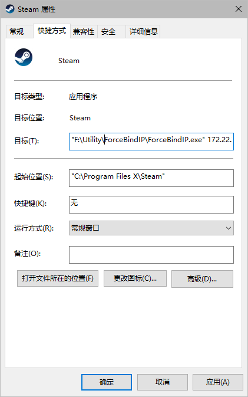



让 Windows 平台应用程序通过不同网卡进行联网。



<!-- more -->

## 起因&需求

由于校园网网速过慢（只有 50Mbps），以及限速策略不方便，Steam 满速下载时基本上就干不了其他事情了，看个视频都卡得一批，于是就有了提速和分流的想法。

关于提速有想过单线多拨，但苦于钱包空空，没法用软路由的解决方案，暂时作罢。分流的话，主要是因为我有网线+无线网络两种解决方案，如果能让部分应用使用其他网卡上网，岂不是解决了下载时速度被占满的问题？

## 方案一：修改路由表

先查看 Windows 上的路由表：

```powershell
route print
```


我的电脑上有两个网卡，分别是 ip 172.22.22.2 对应的有线网卡和 ip 10.4.x.x 的无线网卡，后者由学校的无线网络分配。因此解决的方法也就是将指定的目的 ip 和网卡接口 ip 的对应规则添加进路由表。

```powershell
route add 60.167.222.0 mask 255.255.255.0 172.22.22.2
```

软件具体走了哪些 ip 可以通过 netstat 命令查看：

```powershell
netstat -ano | findstr 16744 # 16744是进程的PID
```

PID 可以在任务管理器中查看：


**可以看出这个方案很粗暴，我肯定不想用，首先很麻烦，其次 ip 可能出现变动还要改。因此我使用软件控的方案。**

## 方案二：软件控制

参考[r1ch](https://r1ch.net/projects/forcebindip)上的解决方案，使用**ForceBindIP**这个软件让指定程序以指定网卡启动。

### 下载地址

任选其一即可：

- https://r1ch.net/assets/forcebindip/ForceBindIP-1.32-Setup.exe
- https://upyun.secriy.com/download/ForceBindIP-1.32-Setup.exe

### 使用方式

命令行调用 ForceBindIP 启动指定程序：

`[ForceBindIP程序路径] [网卡IP] [可执行应用程序路径]`

例如：

```powershell
"F:\Utility\ForceBindIP\ForceBindIP.exe" 172.22.22.2 "C:\Program Files X\Steam\steam.exe"
```

可以把这行指令放入快捷方式中，这样每次就自动通过 ForceBindIP 启动了：



## 设置网卡优先级

还有最后的一点就是，要设置正确的网卡优先级。

比如我把无线网卡设置为第一网卡，那么系统就会默认使用无线网卡上网，然后让 Steam 按照前文的方案通过有线网卡上网，这就实现了 Steam 下载和日常上网的分离，让下载和浏览网页等都能得到能够实现的最好体验。

设置的方式很简单：

1. 控制面板-网络和 Internet-网络与适配器设置

2. 选择网卡-属性-Internet 协议版本 4-高级-取消自动跃点-设置自动跃点


分别设置两张网卡的跃点数，跃点数越小，优先级越高，比如无线网卡设置为 5，有线网卡设置为 10，那么就优先使用无线网卡。
